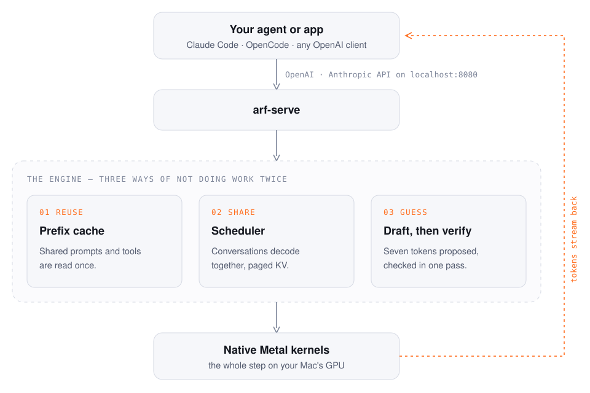

<div align="center">

<picture>
  <source media="(prefers-color-scheme: dark)" srcset="assets/arf-logo-dark.svg" />
  
</picture>

### Run open LLMs on your Mac — an inference engine written from scratch in Rust.

No ML framework underneath. The matmul, the Metal kernels, the scheduler, the server — all written here.

[](https://github.com/joydle/Arf/releases)
[](LICENSE)
[](docs/PLATFORMS.md)
[](https://github.com/joydle/homebrew-tap)

[Website](https://joydle.github.io/Arf/) · [Install](#install) · [Quickstart](#quickstart) · [Coding agents](#use-it-with-coding-agents) · [Performance](#performance) · [How it works](#how-it-works) · [Docs](#documentation)

</div>

---

```sh
brew install joydle/tap/arf
arf run qwen3.8:27b        # chat; the first run asks, then downloads the model
arf launch claude          # or start Claude Code on it
```

That is a 27-billion-parameter model that reads text, images and video, calls tools, and speaks the
**OpenAI and Anthropic APIs** — on `http://127.0.0.1:8080`, on your own machine. Point Claude Code,
OpenCode, Pi or any OpenAI client at it and they work unchanged.

## Why Arf

<table>
<tr>
<td width="50%" valign="top">

**⚡ Fast where it counts**<br>
Continuous batching over a paged KV cache, a trained speculative draft (DFlash-2) for greedy *and*
sampled requests, and the whole decode step on the GPU in native Metal.

</td>
<td width="50%" valign="top">

**🤖 Built for coding agents**<br>
A prefix cache that remembers the system prompt and tool definitions across sessions: a second agent
session answered its first turn in **0.6 s instead of 20.3 s**.

</td>
</tr>
<tr>
<td valign="top">

**🖼️ Text, images, video, audio in**<br>
GPU vision encoder for Qwen3.8 (a 512×384 image in ~0.3 s), video via `ffmpeg`, audio input on
Qwen3-Omni.

</td>
<td valign="top">

**📦 One command per model**<br>
`arf pull` fetches sha256-verified, resumable downloads — no Hugging Face token for public models.
`arf serve` attaches the draft and vision projector for you.

</td>
</tr>
<tr>
<td valign="top">

**🔬 Measured, not claimed**<br>
Every number here is dated, with its machine and method, in [`docs/PERFORMANCE.md`](docs/PERFORMANCE.md)
— including the runs where we lost.

</td>
<td valign="top">

**🦀 Small and readable**<br>
Six Rust crates and a handful of dependencies. Every GPU kernel is checked against a CPU reference
before it is allowed to be fast.

</td>
</tr>
</table>

## Install

**Homebrew** (Apple silicon):

```sh
brew install joydle/tap/arf
```

**From source** (Rust 1.89+):

```sh
git clone https://github.com/joydle/Arf.git && cd Arf
cargo build --release -p arf-cli -p arf-serve
export PATH="$PWD/target/release:$PATH"
```

Then `arf doctor` checks the GPU, the server binary and the network in one go.

**Needs:** macOS 15 or later on Apple silicon; macOS 26 for full speed (the draft that speeds up
Qwen3.8-27B and its fastest prefill use Metal 4 tensor ops, and on macOS 15 it runs without them). The
main model, Qwen3.8-27B, needs **~27 GB of free memory**; smaller models need far less.

## Quickstart

```sh
arf                        # what this Mac can run, what is downloaded, what to type next
arf run qwen3.8:27b        # chat in the terminal
```

`arf run` asks before it downloads a model it does not have yet. The main model is Qwen3.8-27B with its
speculative draft and vision projector, from
[`joydle/Qwen3.8-27B-Arf-GGUF`](https://huggingface.co/joydle/Qwen3.8-27B-Arf-GGUF); on a Mac with
less memory, `arf` suggests a smaller one (`gemma3:4b`, `llama3.2:1b`). The model starts in the background
and stays warm, so the next `arf run` opens at once; in the chat, `/think` shows or hides the model's
reasoning and `/clear` starts over. `arf status` shows what the background model is doing — how far it has
read a long prompt, at what rate, and how long is left (an agent's first message can take minutes); `arf stop`
ends it.

To serve the API in the foreground instead (logs in the terminal), `arf serve qwen3.8:27b`.

```sh
curl -s localhost:8080/v1/chat/completions -H 'Content-Type: application/json' \
  -d '{"messages":[{"role":"user","content":"Name three prime numbers."}]}' | jq -r '.choices[0].message.content'
```

> Models download into `~/.arf/models` (or `./models` when that directory exists, as in a source checkout;
> `ARF_MODELS_DIR` or `--dir` choose another), so `arf serve` finds them from any directory. `arf pull` with
> no argument lists every shorthand; `arf ls` shows what is on disk. Before downloading, `arf pull` checks the
> weights' size against this Mac's RAM: it refuses a model `arf serve` could not load here (`--force` downloads
> anyway) and warns when one will be tight. The Qwen3.8-27B weights alone are 17.1 GB, so it needs more than 16 GB.

## Use it with coding agents

```sh
arf launch claude          # Claude Code on the local model
arf launch opencode        # OpenCode
arf launch claude -- --resume     # anything after -- goes to the agent
```

`arf launch` starts the model in the background if it is not running, then starts the agent pointed at it
(with the model's real context window). Your agent's own settings are not touched: everything is passed in
its environment. By hand, for any agent or client:

```sh
ANTHROPIC_BASE_URL=http://127.0.0.1:8080 ANTHROPIC_AUTH_TOKEN=local claude --model qwen3.8-27b
# OpenCode, Pi, or any OpenAI client: base URL http://127.0.0.1:8080/v1
```

Tool calls are rendered through the model's own chat template. A new session reuses the cached tool
definitions — even in another directory — and every later turn resumes near the end of the previous
prompt.

<details>
<summary><b>More requests: Anthropic shape, Responses API, images, video, audio, System One decisions</b></summary>

Anthropic `/v1/messages`:

```sh
curl -s localhost:8080/v1/messages -H 'Content-Type: application/json' -H 'x-api-key: local' \
  -d '{"model":"qwen3.8-27b","max_tokens":256,"messages":[{"role":"user","content":"Name three prime numbers."}]}'
```

OpenAI Responses API `/v1/responses` (string or item `input`, function tools, streaming events;
`previous_response_id` is not supported — send the conversation in `input`):

```sh
curl -s localhost:8080/v1/responses -H 'Content-Type: application/json' \
  -d '{"model":"qwen3.8-27b","input":"Name three prime numbers.","max_output_tokens":256}' | jq -r '.output[-1].content[0].text'
```

An image, as a `data:` URL (`image_url` parts, or Anthropic `image` blocks):

```sh
printf '{"messages":[{"role":"user","content":[
  {"type":"image_url","image_url":{"url":"data:image/png;base64,%s"}},
  {"type":"text","text":"What is in this picture?"}]}]}' "$(base64 -i photo.png)" > req.json
curl -s localhost:8080/v1/chat/completions -H 'Content-Type: application/json' -d @req.json | jq -r '.choices[0].message.content'
```

A video works the same way with a `video_url` part (`fps` and `max_frames` optional); it needs `ffmpeg`
on the server's `PATH` (`brew install ffmpeg`).

Audio (Qwen3-Omni): serve the model with its audio encoder, then send `input_audio` parts (`wav` or `mp3`):

```sh
arf pull ggml-org/Qwen3-Omni-30B-A3B-Instruct-GGUF --file Qwen3-Omni-30B-A3B-Instruct-Q4_K_M.gguf --out models/qwen3-omni
python3 scripts/ref/qwen3_omni/fetch_audio_tower.py models/qwen3-omni   # the audio encoder only, 1.3 GB
arf serve models/qwen3-omni/Qwen3-Omni-30B-A3B-Instruct-Q4_K_M.gguf --audio-tower models/qwen3-omni/audio_tower.safetensors
```

System One decisions (`/v1/systemone`, TypeSafe-compatible): a decision model answers typed questions
about a `state` — `choice`, `score` (ordered levels) or `noul` (yes/no) — from one prefill per
question, with no generation:

```sh
curl -s localhost:8080/v1/systemone -H 'Content-Type: application/json' -d '{
  "state": "I was charged twice for my order last week and nobody has replied.",
  "questions": {
    "route":   {"type": "choice", "instructions": "Which team should handle this?",
                "criteria": {"billing": "payments and refunds", "shipping": null, "technical": null}},
    "urgency": {"type": "score", "instructions": "How urgent is this?",
                "criteria": ["can wait", "this week", "today", "right now"]},
    "angry":   {"type": "noul", "instructions": "Is the customer angry?"}}}'
```

Each answer carries `probabilities` and a `confidence` (a `noul` answer is the probability of yes);
`usage.input_tokens` counts every question's prompt. The model must be a decision model: today that is
the **openjev** family, whose weights are licensed **CC-BY-NC-4.0 (non-commercial)**. Image input and
the other decision families (lev, nimble, kev, laya, clef) are not supported yet and answer `501`.
Answers are checked against llama.cpp's on the same GGUF and requests
([`scripts/probes/systemone_parity.py`](scripts/probes/systemone_parity.py)).

</details>

<details>
<summary><b>Configuration</b></summary>

| variable | what it does |
|---|---|
| `ARF_KV_CACHE_CAP_TOKENS` | Soft cap on cached KV, in tokens (default 131,072, ~4.4 GB when full; `0` = no cap). Keeps memory flat over many sessions. |
| `ARF_IMAGE_FILES` | `1` lets image and video parts name a local file. Off by default. |
| `ARF_MEDIA_URLS` | `1` lets image, audio and video parts name an `http(s)` URL: public addresses only, no redirects, 64 MB / 20 s per reference. Off by default (the server has no authentication). |
| `ARF_QWEN_VIDEO_MAX_TOKENS` | Tokens one video may take (default 2,048). |
| `HF_TOKEN` | Hugging Face token, for gated repos only. |
| `ARF_MODELS_DIR` | Where models are downloaded and looked up (default `~/.arf/models`, or `./models` if it exists). |
| `ARF_PULL_MAX_MBPS` | Download rate cap for `arf pull`. |

Every supported variable is in [`docs/ENV_SUPPORTED.md`](docs/ENV_SUPPORTED.md).

</details>

## Performance

Qwen3.8-27B at ~4 bits on one Apple M4 Max (36 GB). Every engine on the same machine, through the same
client, with the same prompts.

**Coding agents** — wall time from prompt to passing tests, three tasks, median of three rounds:

| agent | time to passing tests |
|---|---:|
| Claude Code | 256 s |
| Pi | 85 s |
| OpenCode | 155 s |

**Five engines, one client:**

| | Arf | Splash 1.1.0 | MLX 0.31.3 | llama.cpp | Ollama 0.34.4 |
|---|---:|---:|---:|---:|---:|
| 4 requests at once (tok/s) | **63.3** | 60.4 | 45.4 | 18.2 | 16.7 |
| decode, one stream (tok/s) | 61.3 | **67.3** | 20.1 | 17.3 | 16.8 |
| time to first token, 2.45K-token prompt | 13.09 s | 12.98 s | **12.62 s** | 15.47 s | 16.11 s |

Where we lose, we say so: on a single plain-chat stream the fastest engine in the table is ~10% ahead, and a
re-run on a heavily loaded machine read ~20% lower for every engine, with Arf behind in every column. The
method and the dates are in [`docs/PERFORMANCE.md`](docs/PERFORMANCE.md). `make bench-me` measures your own
machine.

## How it works

<picture>
  <source media="(prefers-color-scheme: dark)" srcset="assets/how-it-works-dark.svg" />
  
</picture>

| crate | holds |
|---|---|
| [`arf-ml`](crates/arf-ml/) | tensors, block-quant formats, the CPU matmul — the reference every GPU kernel is checked against |
| [`arf-core`](crates/arf-core/) | models, GGUF / safetensors, tokenizer, paged KV, the batching scheduler, sampling, speculation |
| [`arf-gpu`](crates/arf-gpu/) | the native-Metal path and portable wgpu; the whole decode step on the GPU |
| [`arf-serve`](crates/arf-serve/) | the OpenAI- and Anthropic-compatible server |
| [`arf-cli`](crates/arf-cli/) | `arf pull` / `ls` / `run` / `serve` / `generate` / `inspect` / `doctor` |
| [`arf-router`](crates/arf-router/) | optional: one prefix-aware endpoint in front of several machines |

Dependencies are deliberately few: `wide`, `memmap2`, `safetensors`, `tokenizers`, `clap`; `wgpu` for the
GPU; `axum` and `tokio` for the server. Weights load memory-mapped from single-file **GGUF** or Hugging
Face **safetensors**; resident formats are bf16, int8 and 4-bit Q4_0 / Q4_K / Q4_K_S / Q3_K, with
activations, norms and attention in f32.

## Models

| model | what you get |
|---|---|
| **Qwen3.8-27B** | the main model — hybrid gated-delta-net + attention, speculative draft, image and video input |
| Qwen3-Omni-30B-A3B | mixture of experts, audio input with text output |
| Qwen3-Coder-30B-A3B | mixture of experts (128 experts, top-8) |
| Muse Glimmer 30B | dense; 3:1 sliding-window (2048) and global attention |
| openjev (System One) | decision models built on Qwen3.8-27B: `POST /v1/systemone` answers typed questions (`choice`, `score`, yes/no) with label probabilities, no generation. Matches llama.cpp on its reference model; the 27B GPU check is pending. Weights CC-BY-NC-4.0 (non-commercial) |
| Llama 3.2 (1B, 3B) | dense; the quickstart model |
| Gemma 3, Gemma 4 (12B, 31B) | dense; Gemma 3 with SigLIP vision. No public Gemma 4 GGUF mirror yet: bring your own file |
| FLUX schnell | diffusion transformer, text to image |

[`docs/PLATFORMS.md`](docs/PLATFORMS.md) says exactly what has run where.

### 3D generation (planned, not built)

> [!WARNING]
> **3D model support is not built yet, and the planned models come with licence restrictions you must
> check before using them.**
>
> - **TRELLIS.2** (image to 3D, MIT) is the first planned port. Its
>   default pipeline needs **DINOv3**, which is gated under Meta's licence: you download it yourself after
>   accepting that licence. Arf will not ship or mirror those weights.
> - **Hunyuan3D 2.1** is planned after it, as **bring your own weights** only. Tencent's licence **does not
>   grant rights in the EU, the UK or South Korea**. If you are there, you may not be allowed to use it.
>   Arf ships no Tencent code or weights, and you are responsible for complying with the licence of any
>   weights you load.

## Limitations

- **Apple silicon only, in practice.** Linux builds and passes the CPU test suite; Linux GPU via
  wgpu/Vulkan compiles but has never been run.
- **No authentication.** `arf serve` is a local server — do not expose it to a network
  ([`SECURITY.md`](SECURITY.md)).
- **One GPU per process.** [`arf-router`](crates/arf-router/) puts one endpoint in front of several
  machines.
- **Image and video requests** decode greedily, without speculation. Remote `http(s)` URLs are fetched only with `ARF_MEDIA_URLS=1`.
- **MoE models served by the Metal island** (Qwen3-Coder-30B) decode greedily: temperature, top-p/top-k,
  logprobs, JSON mode and repetition penalty have no effect, and a JSON-mode request comes back as plain
  text. Every response from such a model says so in its `x-arf-warning` header.
- **`--no-think`** (`arf run`) does not stop every model from writing its reasoning.
- **Claude Code in auto mode**: its safety check is a ~30,000-token prompt, read once (~3 min on an M4 Max)
  and then kept on disk. `arf launch claude` reads it in the background from the start, but in the very
  first session after an install or upgrade the first tool calls can still come back "temporarily
  unavailable" while it is read; Claude Code retries them.
- **Speech output** is not built yet — audio is input only.
- **System One** (`/v1/systemone`) serves only openjev-family decision models (CC-BY-NC-4.0), text only
  — no image input yet, and not the lev, nimble, kev, laya or clef families.
- **3D generation** is not built yet — see the [licence warning](#3d-generation-planned-not-built).
- **Inference only** — no training.

## Documentation

| to read | go to |
|---|---|
| the full technical account | [`docs/ENGINE.md`](docs/ENGINE.md) |
| how a token flows through the engine | [`docs/HOW_IT_WORKS.md`](docs/HOW_IT_WORKS.md) |
| the GPU kernels | [`docs/KERNELS.md`](docs/KERNELS.md) |
| what the `unsafe` is, and what keeps it sound | [`docs/SAFETY.md`](docs/SAFETY.md) |
| measured results, with dates and method | [`docs/PERFORMANCE.md`](docs/PERFORMANCE.md) |
| every doc, by purpose | [`docs/README.md`](docs/README.md) |

## Contributing

Kernels, model ports, docs, benchmarks and bug fixes are all welcome — start with
[`CONTRIBUTING.md`](CONTRIBUTING.md). Two house rules: **correctness gates speed** (every kernel is checked
against a CPU reference before anyone measures it), and **a performance claim needs an interleaved A/B in
one session**. Before you look for a speed-up, read the comments where the code says what was measured and
lost — many good ideas already have.

```sh
make check        # every CI gate, in CI's order
```

Security reports: [`SECURITY.md`](SECURITY.md).

## The name

[Cahit Arf](https://en.wikipedia.org/wiki/Cahit_Arf) (1910–1997) was a Turkish mathematician — the Arf
invariant, Arf rings, the Hasse–Arf theorem — who in 1959 gave a public lecture titled *"Can a machine
think, and how can it think?"*, nine years after Turing asked it
([the story](https://www.techletter.co/p/can-machines-think-turing-and-cahit)). The mark is a trefoil: the
simplest knot whose Arf invariant is 1.

## License

[Apache-2.0](LICENSE). Third-party attributions are in [`NOTICE`](NOTICE).
